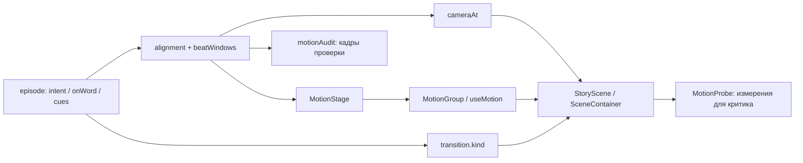

# Движок движения ShortVideo

Ядро добавлено параллельно кузнице визуалов. Визуал отвечает за сущности и
смысловую композицию; motion — за изменение их отношений во времени. Режиссёр
сначала ищет выразимый ход в каталоге, затем параметризует/комбинирует его и
только при пробеле пишет небольшой переиспользуемый примитив. Рост библиотеки
происходит через ту же роль и Git, что рост визуалов: runtime не переписывает
себя во время рендера.

## Диагноз и принятые решения

Диагноз из задания подтверждён исходным кодом: в `StoryScene.tsx` план выбирался
по `cams[slot.beat.visual]`, за 9 кадров менялась поза, дальше оставались
синусоиды 4–5 px. В `Motion.tsx` всем сценам добавлялся наезд 1 → 1.055.
Три одинаковых визуала получали почти одинаковую камеру. Ни это, ни новые
переходы сами по себе не заставляют зрителя увидеть передачу, отказ или
перестройку. Поэтому API камеры, стыков и объектов разделены.

С замечанием «движения почти нет» есть уточнение: многие старые компоненты уже
двигают частицы и линии. Проблема — отсутствие общего словаря намерений,
повторяемых действий и проверки причинного изменения объектов. Старая
внутренняя анимация остаётся рабочей, но не засчитывается как доказательство
понятного объяснения только потому, что пиксели отличаются.

Противоречия разрешены явно:

- `.claude/agents/animation-director.md` требовал «новый visual в switch +
  camsмап». Таблица удалена; правило заменено регистрацией визуала и планом
  `beats[].motion`.
- `.claude/skills/animator/style.md` утверждал «лёгкий Ken Burns ~5% на всю
  сцену (одинаковый для всех)» и «Переход между сценами — один». Эти описания
  заменены новым словарём; прежние обещания больше не соответствуют движку.
- Та же роль говорила «Работай только в переданном delegate worktree». Это
  правило запуска производственной роли, не ограничение текущего задания:
  прикреплённый промпт прямо задаёт репозиторий и `feature/motion-engine`.
- `critic.md` называл `Root.tsx` единственным источником вычета стыков. Формула
  там сохранена. Аудит использует те же `sceneFrames`/`beatWindows` и константу
  10; тест проверяет совпадение полной длины.
- Разбор `corrections/auto-20260909-052001/REPORT.md` уже отверг рост числа
  компонентов как KPI. Новая кузница придерживается этого исправления:
  отсутствие новых файлов допустимо, когда имеющийся словарь выражает смысл.

## Модель времени

Никаких ручных таймингов в episode не появилось:

```text
FPS = 30; LEAD = 0.2 sec; TAIL = 0.55 sec
sceneFrames = ceil((0.2 + meta.duration + 0.55) * 30)
sceneStart[i] = sum(sceneFrames[j], j<i) - 10*i
episodeFrames = sum(sceneFrames) - 10*(N-1)
wordFrame = round((0.2 + word.start) * 30)
```

В `examples/motion-engine.meta.json` сцены имеют длины 458, 442, 351, 409,
602 кадра, старты 0, 448, 880, 1221, 1620 и общую длину 2222 кадра. Это
реальный alignment существующего эпизода; реплики длиннее целевых 60–70 секунд
и взяты как техническая фикстура, а не новый рекомендованный сценарий.

Биты — полуинтервалы `[start,end)`, разбивают сцену без дыр и изменения длины.
Первый начинается с 0. Legacy `beat.onWord` оставлен с нечётким поиском:
старые эпизоды используют, например, «номер» для «номером». Плохие/слишком
близкие legacy-якоря ограничены так, чтобы каждый бит получил минимум кадр.
При новой хореографии якорь проверяется внутри полученного окна; не найденное
слово и событие за границей вызывают ошибку, а не заменяются процентом.

Motion-якорь — точный нормализованный display-токен: регистр, пунктуация и
знак ударения не значимы; `occurrence` выбирает повтор, начиная с 1. У
`{UNIQUE INDEX|уникальный индекс}` один токен `UNIQUE INDEX`; речь и форма
показа не смешиваются. В fixture cue «конфликт» находится на локальном кадре
314 сцены 3, глобальном 1535. До него, посередине и в конце действия получаем
1535, 1547, 1559 (слово совпадает с первым кадром бита, поэтому предыдущий
кадр самого бита недоступен; кадр старой фазы 1534 проверяется отдельно).

Фолбэк для старого JSON: `act` на 30%, `resolve` на 70% существующего окна;
для другого отсутствующего cue — середина. В новых эпизодах режиссёр обязан
поставить существенные cues словами. Проценты живут только в совместимом
runtime, не в сценарной разметке.

## Устройство



`SceneContainer` сохраняет вход и ограниченный импакт, убирает постоянный
Ken Burns. Камера story оборачивает только поле визуала; заголовок story и
караоке не следуют за ней. Остальные сцены получают одну камеру на сцену.
`StoryScene` по-прежнему выбирает визуал своим switch, но больше не знает,
какая камера «положена» этому имени. Внутренние props старых визуалов
`local/fps/impactLocal` сохранены; 91 отдельный файл переписывать не требуется.

`MotionStage` даёт frame, окно бита, resolved cues. `MotionGroup` отделяет
transform от layout объекта и выдаёт вход/действие из словаря. Кадр вычисляется
заново без накопленной скорости, эффектов по времени, CSS-анимаций и гонок
состояния. Новые функции не используют random вовсе. Существующие seeded
random Remotion для фоновых частиц не изменены.

## Камера

Словарь в `camera.ts`: hold, push-in, pull-out, track, settle. Намерения
establish/focus/reveal/follow/compare/resolve выбирают их без ссылки на visual.
Явный `camera.preset` разрешён, `strength` ограничен 0…1, target — точка канваса
в нормализованных координатах. Старт движения — `camera.onWord` либо старт
бита. Результат считается от реальной конечной позы прошлого бита, так что
в начале следующего кадра камера не телепортируется.

Общий план `(x=0,y=-12,scale=.92)`, transform-origin `(540,760)` px. Для
push-in при strength=1 конечный scale=.99, pull-out=.89. Фокус смещает x на
`(0.5-target.x)*64`, y на `-12+(0.4-target.y)*40`; максимальные смещения
ограничены десятками пикселей. Track без target идёт на x=-28 и scale=.95.
Это намеренно умеренная камера для существующих широких композиций. Реальное
исчезновение/приближение объектов выполняет хореография, а не опасный зум.

```ts
const end = Math.min(beat.end - 1,
  anchor + Math.max(1, Math.min(36, Math.round((beat.end - anchor) * .4))));
const u = clamp((frame - anchor) / (end - anchor), 0, 1);
const p = u*u*(3-2*u); // нулевая скорость на обоих концах
pose = previousPose + (targetPose - previousPose) * p;
```

Однокадровое окно сразу принимает конечную позу. После движения камера держит
план: пауза для чтения допустима. Без декларации первый бит берёт establish,
последующие чередуют focus/reveal; это безопасное резервное поведение,
не автоматическое понимание текста. Для нового ролика намерение задаёт режиссёр.

## Переходы

`motionPresentation` применяет registry из `transitions.tsx` к TransitionSeries;
`motionTiming` всегда даёт 10 кадров и smoothstep(frame/9). Продолжение — match
(28 px вверх + прозрачность), поворот — push (96 px по горизонтали), контраст —
wipe (две дополняющие clipPath-шторки), финал — dissolve (прозрачность + 2%
масштаб). Фон общий, полноэкранная смена цветных заливок не создаётся.

Внутри story прежняя фаза сохраняется на
`max(1,min(8,floor(previousLength/3),floor(nextLength/3)))` кадров нового бита.
Она получает последний `local` своего окна и выходит, новая входит с начала
своего. При длине 1 вход сразу полностью виден. В остальных случаях blend —
smoothstep(local/(length-1)). Только во время этого окна рендерятся два visual.
Сцена при этом не удлиняется, звук не получает второго запуска.

Это переход между композициями, не универсальная интерполяция произвольных
React-деревьев. Для общего объекта, который должен непрерывно менять топологию,
нужен параметрический визуал и MotionGroup/useMotion, а не автоматическое
сопоставление DOM по тексту. Старые визуалы с собственным useCurrentFrame
продолжают жить в сценовом времени; именно у перенесённых объектов MotionStage
даёт полностью зафиксированный исходящий кадр. Массовую миграцию см. ниже.

## Хореография и рабочий визуал

Входы rise/cascade/materialize и действия transfer/recoil/pulse/depart — чистые
функции. Cascade разносит группы на 0/4/8/12 кадров, уводит их от краёв на
±44 px; rise начинается на y+36; materialize — scale .9. Вход группы длится
до 12 кадров, вместе со стэггером до 24. Для короткого окна стэггер сжимается,
и последняя поза обязательно видима.

Действие стартует на cue и занимает `min(24, nextCue-start, beat.end-1-start)`
кадров. Никаких задержек в JSON. Transfer интерполирует пространственные
from/to. Recoil добавляет дугу `-20*sin(pi*p)` и уменьшает opacity до .65;
pulse даёт `1+.12*sin(pi*p)`; depart снижает opacity до нуля. Нужны новая
геометрия или другой рисунок движения — сначала композиция, затем кузница.

```tsx
const motion = useMotion();
const p = motion.action("act"); // те же якоря для SVG и объектов
return <MotionGroup id="packet" index={1}
  action={{preset: "transfer", cue: "act", to: {x: 180, y: 120}}}>
  <div data-motion-shape style={{position: "absolute", left: 240, top: 500}}>
    {/* объект, а не строка нарратива */}
  </div>
</MotionGroup>;
```

Тот же ход можно выбрать в JSON по стабильному id группы. Например,
`motion.actors["request-b"] = {"preset":"recoil","cue":"act","to":{"x":75,"y":-55}}`.
Это переопределяет action по умолчанию в MotionGroup, не переписывая визуал.
До четырёх overrides, from/to в пределах ±540 px; существующий cue обязателен.
Имена объектов — часть контракта визуала. MotionProbe сообщает missingActors,
а smoke возвращает ошибку, если объявленная группа не найдена на кадре.

`data-motion-shape` обозначает тело объекта для диагностики. Его координаты
измеряются относительно композиции, а не скрытого портала Remotion. Для
сложного SVG можно ставить `data-motion-actor` прямо на circle/группу и
показывать собственные локальные координаты. Измерения не управляют анимацией.

Полностью переработан `UniqueInsertRaceVisual.tsx`: request разносит запросы
и показывает принятие/отбрасывание; check ведёт два чтения к индексу; insert
сводит и убирает запросы, проявляя запись; wait паркует B, ведёт стрелку часов,
убирает замок по resolve; conflict отбрасывает B, оставляя запись A. До четырёх
смысловых групп, единый фон, минимум текста. Идентификаторы объектов стабильны.
Внутренние cues act/resolve переиспользуются звуком и shake через
`storySchedule`; отдельной процентной шкалы звука у образца больше нет.

## Кузница и роли

Полный рабочий словарь, формат записи, пример JSON и пороги находятся в
`.claude/skills/animator/motion-catalog.md`. Gap-скан выполняется по тем же
5–6 идеям, что визуальный: идея → бит/стык/фаза → отношения ДО/ПОСЛЕ → нужный
ход → лучшее покрытие → оценка → cue/объект → решение. Оценка 5 — буквальное
действие; 4 — его композиция; 3 — подпись объясняет больше движения; 2 —
декорация; 1 — нужного действия нет. Порог применяется к идеям, а не количеству
строк или глаголов: ≤3 у ≥3 идей требует хотя бы один новый ход; 1–2 пробела
допускают обоснованную композицию; всё ≥4 допускает нулевой рост.

Новый примитив обязан иметь два разных применения, малую чистую реализацию,
ограниченные пространственные параметры, тест трёх поз/короткого окна/seek,
запись каталога, пример и измеренную стоимость. Код, тип, схема и каталог
коммитятся вместе. Сила/сторона/текст не основание плодить почти одинаковые
примитивы. Нельзя «закрыть» пробел передачи данных одним зумом камеры.

`animation-director.md` задаёт обязательный второй gap-скан, шаг кузницы и
расширенный отчёт. `produce/SKILL.md` проверяет его перед TTS, запускает аудит
после alignment, отдаёт его критику. `critic.md` требует сравнить тройки кадров
по отношениям объектов и имеет право отклонить формально движущийся плакат.
Автоматический конвейер не запускался; крон и публикации не менялись.

## Проверки и воспроизведение

```bash
cd video
npx tsc --noEmit
npm run test:motion
cd ..
python3 -m unittest tools/test_motion_validation.py
python3 tools/validate.py examples/motion-engine.json
node video/scripts/check-motion.cjs examples/motion-engine.json examples/motion-engine.meta.json
```

Тесты охватывают повторные/не найденные/выпавшие из бита якоря, короткие окна,
произвольный порядок кадров, диапазоны камеры, видимость однокадрового бита,
стыки, совпадение словарей со схемой и фактические звуки/импакты образца.
До TTS валидатор проверяет schema и display-токены, после TTS motionAudit
проверяет настоящий alignment. Схема не добавляет timing-полей и запрещает
неизвестные поля motion; story-план разрешён только в бите.

Воспроизводимый props-файл для still и smoke (аудио уже лежит в public):

```bash
python3 - <<'PY'
import json
from pathlib import Path
props = {
  'episodeId': 'auto-20260910-052001',
  'episode': json.load(open('examples/motion-engine.json')),
  'metas': json.load(open('examples/motion-engine.meta.json')),
  'motionProbe': True,
}
Path('/tmp/motion-engine-props.json').write_text(json.dumps(props, ensure_ascii=False))
PY
cd video
npx remotion still Episode /tmp/motion-engine.png --frame=1547 --props=/tmp/motion-engine-props.json
node scripts/motion-smoke.cjs /tmp/motion-engine-props.json /tmp/motion-engine-proof
```

`Episode.calculateMetadata` принимает согласованную пару episode/metas для
фикстур; без неё путь episodeId → public/script.json + meta.json работает как
раньше. Новый TTS не нужен. Если исходного аудио на другой машине нет, Preview
работает с fakeMeta; такой Preview не доказывает синхронизацию с реальным голосом.

Smoke делает один bundle, держит один Chromium, рендерит до 24 выбранных кадров
и повторяет первый в конце. Равенство PNG SHA256 и артефактов доказывает seek
для этих кадров. MotionProbe включён только явным `motionProbe:true` и в
полном рендере не добавляет обход DOM. Его opacity учитывает дочерний fade
instrumented shape; локальные x/y/scale/progress не включают движение камеры.
Пиксельный diff всего кадра не используется как автоматическое «motion passed»:
фон и караоке тоже движутся.

Критик сначала смотрит один существенный cue на идею (до/середина/после), затем
новые примитивы и сомнительные стыки. На стыках наложение двух композиций
ожидаемо; старый overlap-чек не знает clipPath и наследуемую прозрачность,
поэтому его геометрические пары на переходе не автоматически означают дефект.
Устойчивые кадры должны проходить обычный overlap-gate. Зелёный motionAudit —
проверка контрактов и времени, не автоматическое доказательство вкуса.

## Стоимость и границы проверки

Новых npm-зависимостей нет. Основные эффекты — transform/opacity и простые SVG,
без blur, canvas-симуляций, WebGL и размножения всей сцены. Вне короткого
перехода существует один visual. При пяти битах на 300 кадров добавляются
максимум 4×8=32 визуало-кадра (около 11% работы визуала, не тройной рендер).
В реальном ролике с двумя битами на сцену доля ещё меньше. Звуки не дублируются.

Изолированный still включает создание страницы и PNG-кодирование, поэтому его
1–2 секунды нельзя выдавать за стоимость кадра потокового JPEG-рендера. Для
сравнения есть `scripts/benchmark-motion.cjs`: одинаковый старый episodeId,
JPEG quality=90, concurrency=3, диапазоны 600…659 и 1530…1569, до/после на
одной Raspberry Pi 5. Исходник до изменений извлекается из commit
2017c801475d3652c6a4181085b4f7af845cfe2f в /tmp, public/node_modules доступны
через ссылки; пользовательский checkout не откатывается.

Фактические результаты прогона и замечания независимого ревью записаны ниже
и в `docs/motion-engine-proof.json`. Полный 2222-кадровый MP4 и все старые визуалы этим
набором тестов не проверяются; это не обещание точного времени каждого будущего
ролика. Новому тяжёлому примитиву нужен собственный замер.

## Раскатка

1. **Сделано:** общее ядро, совместимость JSON, словари, strict cues, phase
   transitions, один визуал целиком, шаблон и реальные тайминги, роли и проверки.
2. **Ближайшие ролики:** режиссёр обязательно заполняет motion-план; переносить
   лишь используемые визуалы. Вначале выделить ≤4 MotionGroup, затем убрать их
   старые общие spring/impact-таймеры и добавить 1–2 смысловых cue на бит.
3. **По семействам:** схемы/пакеты → общие transfer/return/queue; структуры данных
   → reorder/merge/split; физические процессы → счётчик/накопление/порог. Каждый
   отсутствующий ход проходит свой gap-скан, а не создаётся заранее «на всякий».
4. **Фазовые монолиты:** разделить объекты и состояния; если нужна непрерывная
   идентичность между фазами, делать state interpolation внутри одного визуала.
   RtcAlarmWakeupVisual не использовать как эталон: его проблема также в теме,
   числе фаз и дубле текста. Массовый косметический зум её не решит.
5. **После накопления:** сравнивать записи каталога, объединять дубликаты,
   добавлять representative fixtures к каждому новому примитиву, измерять CPU
   на типичных кадрах. Только затем расширять амплитуды камеры по проверенным
   safe bounds и делать более богатые траектории.

Открытые вопросы: какой минимальный сдвиг воспринимается на телефоне; где
необходима длительная непрерывная траектория вместо короткого действия;
какие старые композиции опирались на особый crop из cams; как расширить
геометрический QC на сложные SVG, occlusion и группы вне эталона; когда
нужна идентичность объектов через границу сцен. Эти вопросы не мешают ядру
работать, но требуют проверки на реальных последующих роликах.


## Результаты проверки 11.09.2026

`npx tsc --noEmit` — зелёный; `npm run test:motion` — 13/13;
`python3 -m unittest tools/test_motion_validation.py` — 2/2 (включая набор
невалидных деклараций); schema и аудит реального alignment — зелёные.
`npx remotion still Episode /tmp/motion-engine-final.png --frame=1547
--props=/tmp/motion-engine-props.json` успешно рендерится. Старый эпизод без
motion-полей отдельно отрендерился на кадре 650.

Финальный smoke проверил 24 кадра и повтор первого: SHA256 PNG и DOM-артефакты
совпали. На кадрах 941 → 954 → 966 запрос A проходит (0,0) → (100,97.5) →
(200,195) px, а opacity падает 1 → .5 → 0; запрос B сходится с другой стороны.
Проба видит реальную невидимость карточек и размеры тела, не весь canvas.
Отдельное переопределение из JSON дало request-b точно (40,−65) вместо
базового (75,−55). Попытка назначить действие диагностическому probe-0
завершилась ожидаемым exit 1: группа не управляется через MotionGroup.

| Диапазон, concurrency=3, JPEG90 | До | Финальное ядро | Отношение |
|---|---:|---:|---:|
| 600…659 (60 кадров) | 0.427 с/кадр | 0.403 с/кадр | 0.943× |
| 1530…1569 (40 кадров) | 0.499 с/кадр | 0.427 с/кадр | 0.855× |

Это wall-time участка, делённый на число кадров, с запуском страниц внутри
замера. На обоих участках ядро вписывается примерно в полсекунды на кадр;
тройного удорожания нет. После завершения финального benchmark Chromium
вывел `Page.bringToFront: Target closed` при закрытии браузера; процесс вышел
с кодом 0, все 100 JPEG проверены на наличие. Основные still/smoke/MP4 проверки
завершились успешно.

Дополнительно получен настоящий MP4-фрагмент, не слайдшоу: кадры 1370…1609,
240 кадров 1080×1920 при 30 fps, H.264 + AAC, 8 секунд видеоряда (контейнер
8.064 с из-за аудио), 2.5 МБ. Файл `/tmp/motion-engine-preview.mp4`.
Воспроизведение: `cd video && npx remotion render Episode
/tmp/motion-engine-preview.mp4 --frames=1370-1609
--props=/tmp/motion-engine-props.json --concurrency=3`.

Независимое read-only ревью нашло и помогло закрыть: невидимый однокадровый
бит; рассинхронизацию SFX/действий; неверные bounds/opacity диагностической
обёртки; смешение SVG-маркера с управляемой группой; выход контрольного кадра
за короткий бит. После исправлений и регрессионных тестов — `No findings`.
Общее число исходных компонентов не увеличивалось ради метрики; появился
переиспользуемый слой и один компактный образец вместо прежних 450+ строк.
